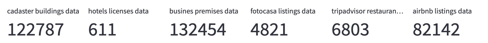

# Turistificacion

##  About

Touristification is a project that aims to create an atlas to measure the impact of tourism in the city of Madrid.

This project is based on the research developed by the architecture studio [300.000 Km/s](http://turistificacion.300000kms.net/) based on multiple data sources: open statistical data (Catastro, Ayuntamiento de Madrid Open Data Platform) and soft-data (scraped or crawled from Tripadvisor and Airbnb).

Their analysis was based on data gathered around 2017, so the aim is to see if something has changed in the city of Madrid. AirBnB listings are growing? The residential house market has been affected? Where are nightclubs, licquor stores or sex shops located and has COVID affected the location on the city?

I used streamlit to display the difference between the input data from 2017 and the data extracted from 2023. 

## Folder structure

- [crawler_tripadvisor](crawler_tripadvisor/)
    - cr_tripadvisor
    - README.md -> an explanation of how the spoders work and the folder structure
- [data](data/) -> this folder stores the input data
- [images](images/) -> the images used on the visualizations and readme
- [notebooks](notebooks/) 
    - [EDA](notebooks/0_EDA.ipynb) -> an EDA of the input data
    - [1_1_ayto_madrid_data_extraction](notebooks/1_1_ayto_madrid_data_extraction.ipynb) -> the extraction from the data of hotel and business premises licenses.
    - [1_2_catastro_data_extraction](notebooks/1_2_catastro_data_extraction.ipynb) -> the extraction from data from catastro
    - [1_3_fotocasa_data_extraction](notebooks/1_3_fotocasa_data_extraction.ipynb) -> the base notebook for the scraping from the listings of fotocasa
    - [2_1_cleaning_geolocaltion_ayto_madrid](notebooks/2_1_cleaning_geolocation_ayto_madrid.ipynb) -> cleaning from the business premises and hotels.
    - [2_2_cleaning_catastro](notebooks/2_2_cleaning_catastro.ipynb) -> this notebook contains the data cleaning for catastro data.
    - [2_3_cleaning_geolocation_fotocasa](notebooks/2_3_cleaning_geolocation_fotocasa.ipynb) -> this notebook contains the cleaning and gelocating from the data scraped from fotocasa.
    - [2_4_cleaning_geolocation_tripadvisor](notebooks/2_4_cleaning_geolocation_tripadvisor_.ipynb) -> the notebook contains the cleaning and geolocation from the data scraped from tripadvisor
    - [2_5_cleaning_geolocation_airbnb](notebooks/2_5_cleaning_geolocation_airbnb.ipynb) -> the notebook that stores the data cleaning from airbnb data.
    - [3_h3_grid](notebooks/3_h3_grid.ipynb) -> notebook that concats all the processed data and generates a spatial index (h3 grid) that merges all the spatial data.
    - [4_kepler] -> the notebooks that contains the basemap generation for the visualizarion.
- [output](output/) 
    - geojson -> this folder stores the processed data from the 2_ notebooks
    - maps -> this folder stores the spatially aggregated data result from the h3 grid.
- [src](src/)
    - [bibliotheque](src/bibliotheque.py) -> this suppoort file stores the equivalences used in the notebooks.
    - [supportCharts](src/supportCharts.py) -> this support files stores the charts that are used on the eda and on the different edas used on the data cleaning to prove the data quality.
    - [supportExtract](src/supportExtract.py) -> the support files stores the steps necessary to extract the data from ayto de madrid.
    - [supportScrapping](src/supportScrapping.py) -> the support file that stores the function to scrape the data from fotocasa.

## Sources:
- [catastro](https://www.catastro.minhap.es/webinspire/index.html)
- [flickr data]()
- [tripadvisor]()
- [fotocasa]()
- [hoteles - datos abiertos de la Ayto Madrid](https://datos.madrid.es/sites/v/index.jsp?vgnextoid=df42a73970504510VgnVCM2000001f4a900aRCRD&vgnextchannel=374512b9ace9f310VgnVCM100000171f5a0aRCRD)
- [local 200 / local 300 - Ayto Madrid](https://datos.madrid.es/sites/v/index.jsp?vgnextoid=66665cde99be2410VgnVCM1000000b205a0aRCRD&vgnextchannel=374512b9ace9f310VgnVCM100000171f5a0aRCRD)
- [Airbnb via AirDNA](http://insideairbnb.com/get-the-data)

## Use

Run visualization:
> streamlit run main.py 

## Toolkit
- [**pandas**](https://pypi.org/project/pandas/): this library is used to work with related and table like data structures.
- [**numpy**](https://pypi.org/project/numpy/): library used for scientific calculation.
- [**pickle**](https://docs.python.org/3/library/pickle.html): a module that generates files that can be used within python to store any kind of data -- from dataframes to dicionaries and so on.
- [**requests**](https://pypi.org/project/requests/): requests is used to make http requests -- mostly used on the API calls notebooks.
- [**xmltodict**](https://pypi.org/project/xmltodict/): is a Python module that makes working with XML feel like you are working with JSON. Used in some of the requests.
- [**os**](https://docs.python.org/es/3.10/library/os.html): os is used for operating system functionalities within python -- for example, accessing .pickle files or navigating on folders within this project.
- [**tqdm**](https://pypi.org/project/tqdm/): this library is used to print a progress meter when iterating.
- [**re**](https://docs.python.org/3/library/re.html): re provides regular expression matching operations to python -- mostly used for cleaning the api results.
- [**datetime**](https://docs.python.org/3/library/datetime.html): The datetime module supplies classes for manipulating dates and times. Used for adding dates for the scrapped data.
- [**selenium**](https://pypi.org/project/selenium/): this package is used to automate web browser interaction from Python. Used for scrapping the data from Fotocasa.
- [**scrapy**](https://pypi.org/project/Scrapy/): Scrapy is a fast high-level web crawling and web scraping framework, used to crawl websites and extract structured data from their pages. Used for scraping the data from tripadvisor.
- [**time**](https://docs.python.org/3/library/time.html): this module provides various time-related functions -- in this case, related to scraping to add timers.
- [**sys**](https://docs.python.org/3/library/sys.html): this library provides access to some variables used or maintained by the interpreter and to functions that interact strongly with the interpreter.
- [**warnings**](https://docs.python.org/3/library/warnings.html): this library helps to hide the annoying warnings that python sometimes throws.
- [**keplergl**](https://pypi.org/project/keplergl/): A jupyter widget for kepler.gl, an advanced geospatial visualization tool, to render large-scale interactive maps. Used for generating the map visualizations for streamlit.
- [**matplotlib**](https://pypi.org/project/matplotlib/): Matplotlib is a comprehensive library for creating static, animated, and interactive visualizations in Python. It is mostly used in EDA and map representation.
- [**seaborn**](https://pypi.org/project/seaborn/): Seaborn is a Python visualization library based on matplotlib. It provides a high-level interface for drawing attractive statistical graphics. It is mostly used for EDA.
- [**geopy**](https://pypi.org/project/geopy/): this is a python client used for geolocating the hotel listings based on the address, to get the coordinates in order to represent them on the dashboard.
- [**geopandas**](https://pypi.org/project/geopandas/): this is a library that allows to work with geospatial data thorugh python, combining the usability of the pandas and shapely library. This library is used to manipulate all of the geospatial data used on the project (POIs, hotel listings once geolocated)
- [**io**](https://docs.python.org/3/library/io.html): this library is used for operating with files objects in python. In this case is used to unzip the downloaded zips from data.
- [**fiona**](https://pypi.org/project/Fiona/): fiona is a library used to manage GIS data in python. It is used to manipulate data on shape and GeoPackage format.
- [**Catastro Inspire Downloader**](https://pypi.org/project/CatastroInspireDownloader/): A Python library that downloads the information related to cadastral parcels and buildings in Spain.
- [**contextily**](https://pypi.org/project/contextily/): small python package to retrieve basemaps from the internet. Used for support in geospatial data visualizations.
- [**pyproj**](https://pypi.org/project/pyproj/): a python library used for cartographic projections. Used for changing the projection od geodataframes. 
- [**H3-pandas**](https://h3-pandas.readthedocs.io/en/latest/): H3 is a library that generates hexagonal hierarchical geospatial indexing system. Used for creating the data agroupations.

## Acknowledgements

This project was possible with the help of my teacher [Ana](https://www.linkedin.com/in/ana-garcia-garcia-090a5058?miniProfileUrn=urn%3Ali%3Afs_miniProfile%3AACoAAAxBzWwBZPZEPf67SF_Sml5a7dUrPKlT2BA&lipi=urn%3Ali%3Apage%3Ad_flagship3_search_srp_all%3BNLhJzc54Sq2TtZXPk8mNqg%3D%3D), [Cesar](https://www.linkedin.com/in/cesar-valle-iturriaga?miniProfileUrn=urn%3Ali%3Afs_miniProfile%3AACoAADnW_GcBlDE79-gPyr8h2PlMAlf5J_DWSZQ&lipi=urn%3Ali%3Apage%3Ad_flagship3_search_srp_all%3BvICojuuzRV%2BEChVxgxL6Cg%3D%3D) and [Jean-Cha](https://www.linkedin.com/in/jeancharlesyamada?miniProfileUrn=urn%3Ali%3Afs_miniProfile%3AACoAABrrjKUBJ8xYPKt6ffiDou2_VsEBzBj9p80&lipi=urn%3Ali%3Apage%3Ad_flagship3_search_srp_all%3BErY77kNORJeXVe1TZ8quoQ%3D%3D).

Also feel free to contact me if you see any mistakes or you want to learn more [here](mailto:annassanchez@gmail.com).